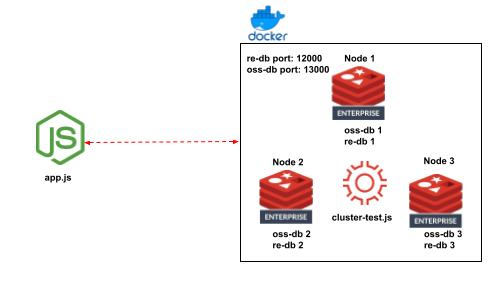

# Redis Triggers and functions write operations with RE and RE w/OSS Cluster API

## Contents
1.  [Summary](#summary)
2.  [Architecture](#architecture)
3.  [Data Input](#datainput)
4.  [Features](#features)
5.  [Prerequisites](#prerequisites)
6.  [Installation](#installation)
7.  [Usage](#usage)
8.  [Results](#results)

## Summary <a name="summary"></a>
This is code demonstrates a workaround for the Trigger and function challenge with remote writes in two different modes:  RE cluster, RE w/OSS Cluster API.  

## Architecture <a name="architecture"></a>
- Two databases each with 3 shards are created.  
- One database is enabled with the OSS Cluster API; the other is a proxy-based Redis Enterprise database.  
- A simple Redis function is deployed to each database.  That function performs a SET to a key passed as an argument.  - A Nodejs app is used to call that Redis function.  The app has 2 client connections: OSS cluster client to the OSS DB, and standard node-redis connection to the RE DB.
- Redis CLI is leveraged to view the databases' state after the app run.

 


## Data Input <a name="datainput"></a>
Below shows the hash slot mapping for the three keys to be tested.  One key maps to each of the 3 shards (RE and OSS).
```bash
> cluster keyslot abc:1
(integer) 2336

> cluster keyslot key:1
(integer) 6657

> cluster keyslot {xyz:}1
(integer) 12708
```
## Features <a name="features"></a>
- Builds out a full RE environment with 3 nodes and 2 databases.  One DB is OSS Cluster enabled, the other standard RE.

## Prerequisites <a name="prerequisites"></a>
- Ubuntu 20.x
- Docker Compose
- Docker
- Valid Redis Enterprise license file that supports at least 6 shards

## Installation <a name="installation"></a>
```bash
git clone https://github.com/Redislabs-Solution-Architects/cluster-func.git && cd cluster-func && npm install
```

## Usage <a name="usage"></a>
### Start
```bash
./start.sh
```
### Stop
```bash
./stop.sh
```

## Results <a name="results"></a>
```bash

*** RE Write Tests ***
*** SET abc:1 ***
response: OK
*** SET key:1 ***
response: OK
*** SET {xyz:}1 ***
response: OK

*** RE Read Tests ***
*** GET abc:1 ***
response: val:1
*** GET key:1 ***
response: val:2
*** GET {xyz:}1 ***
response: val:3

*** OSS Cluster API Write Tests ***
*** SET abc:1 ***
response: OK
*** SET key:1 ***
response: OK
*** SET {xyz:}1 ***
response: OK

*** OSS Cluster API Read Tests ***
*** GET abc:1 ***
response: val:1
*** GET key:1 ***
response: val:2
*** GET {xyz:}1 ***
response: val:3
```